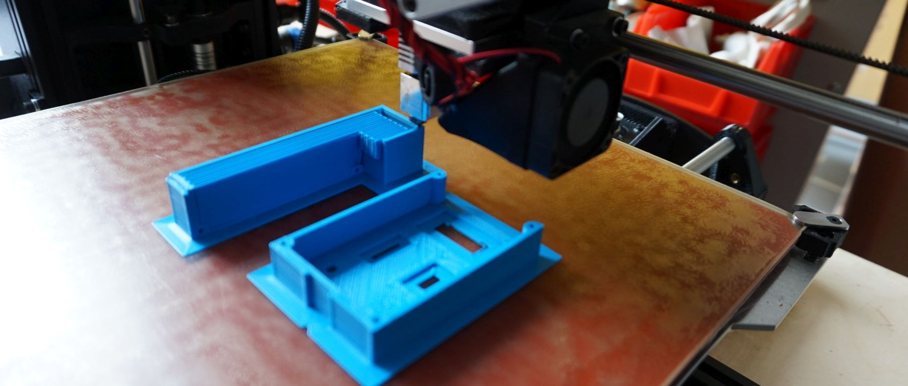
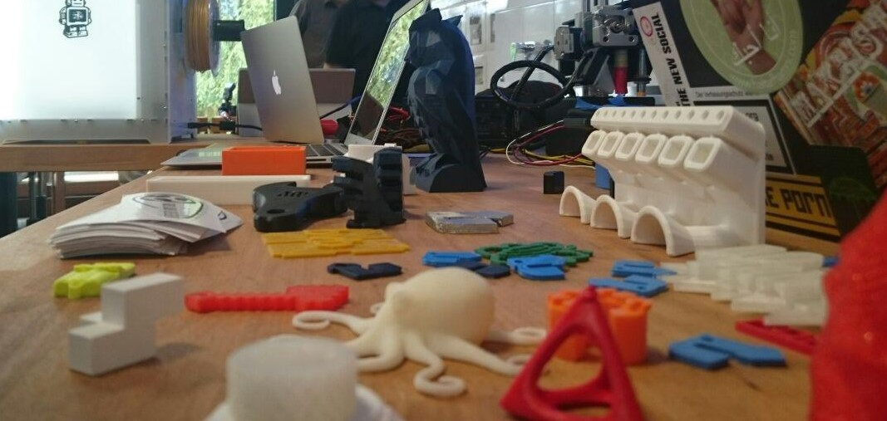
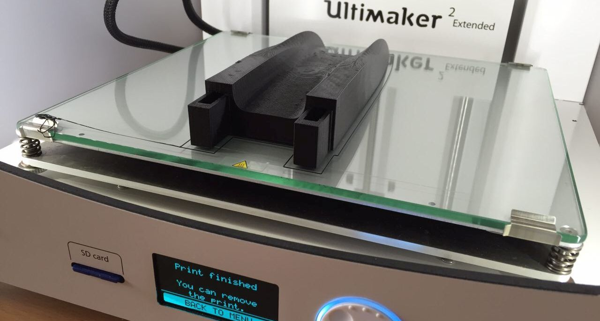

3D-Drucker, die nach dem [Schmelzschicht-Verfahren](https://de.wikipedia.org/wiki/Fused_Deposition_Modeling) (engl. Fused Deposition Modeling, FDM) arbeiten. Das sieht so aus:

**Notwendige Einweisungen:** [Allgemeine Sicherheitseinweisung](!Einweisungen_und_Regeln/index), [3D-Drucker](!Einweisungen_und_Regeln/Einweisung_3D-Drucker/index)

## FDM- Drucker im Lab

Gerät |  Eigenschaften  | Links
------|:---------------:|------:
[Ultimaker 2 Extended](#um2e) | Feines Druckbild, großer Bauraum | [Handbuch (Deutsch)](https://ultimaker.com/download/3345/UserManual-UM2Extended-v1-DE.pdf), [Kalibrierung](https://ultimaker.com/en/resources/168-calibration), [Wartung](https://ultimaker.com/en/resources/174-cleaning-the-glass-plate)
[Lulzbot TAZ 5](#taz5) | Größter Bauraum, Druck mit zwei Materialien | [Handbuch (englisch)](http://download.lulzbot.com/TAZ/5.0_0.5noz/documentation/Manual/9780989378475_interior.pdf), [Leveling](https://www.youtube.com/watch?v=EdB8jbXFfns), [Material-Profile](https://www.lulzbot.com/taz-cura-profiles)
[Printrbot Simple Metal](#pbsm) | Kompakt, robust | [Website und Dokumentation](http://printrbot.com/project/simple-metal/)
[Aya](#aya) | Delta-Drucker, Eigenbau, sehr schnell |  [Dokumentation](!Projekte/Aya), [Bauart (Kossel Mini)](http://reprap.org/wiki/Kossel)
[Tiko](#tiko) | Delta-Drucker, noch in Beschaffung | [Website](https://www.tiko3d.com/) |
[Makerbot Replicator Dual](#mbrep) | Druck mit zwei Materialien | [Bedienungsanleitung](http://support.makerbot.com/learn/earlier-products/replicator-original)
[Makerbot Replicator 2X](#mbrep) | In Reparatur und Revision |  [Bedienungsanleitung](https://eu.makerbot.com/fileadmin/Inhalte/Support/Manuals/Quick_Start_Guides/MakerBot_Replicator2X_UserManual_Ger.pdf)

## Materialien und Möglichkeiten

Infos folgen

## Ultimaker 2 Extended 

## Lulzbot TAZ 5 

## Aya 

- Eigenbau
- Funktionsprinzip: [Delta Robot](https://en.wikipedia.org/wiki/Delta_robot)
- [Dokumentation](!Projekte/Aya)

## Printrbot Simple Metal 

## Tiko 

## Makerbot Replicator dual 

## Makerbot Replicator 2x 

## Bedarfe
- Verbrauchsmaterialien (jede Menge)
- Vorrat an Ersatz- / Verbrauchsteilen

## ToDo

- Genauere Auflistung, insb. "seltenere" Werkzeuge, soweit vorhanden
- Fotos
- Bedarfe ergänzen
