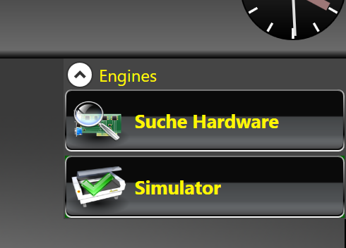
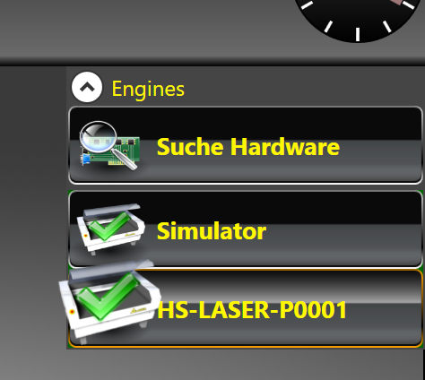

* Hersteller: EAS

## Bedienungsanleitung:
### 1. Einschalten und verbinden
Anschalten der Maschine (Sicherung auf der Rückseite auf _ON_. Drücken auf den grünen Knopf vorne)

LaserlineX6-Software starten.

Nach Hardware suchen.

Gefundenen Drucker auswählen.

Wenn die Nachfrage zur Referenzfahrt kommt, diese durchführen, wenn der Fahrraum frei und sicher ist!

