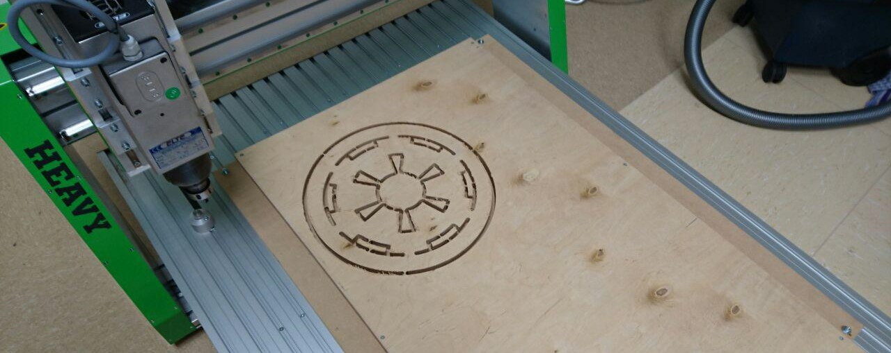

Portalfräse, 1500mm x 800mm x 170mm Verfahrweg. 2.2kW Spindel, auswechselbar mit Tangentialmesser (zum präzisen Schneiden dünner Materialien).

**Notwendige Einweisungen:** [Allgemeine Sicherheitseinweisung](!Einweisungen_und_Regeln/index), [Fräse](!Einweisungen_und_Regeln/Einweisung_Fräse/index)

* Gerätehersteller: EAS, Typ Heavy 800XL [Herstellerlink](http://www.easgmbh.de/CNC-Maschinen/Fraesmaschinen/HEAVY/800XL)
* [Datenblatt](http://www.easgmbh.de/2015/PDF_Datenblaetter/1300,035_CNC_Maschine_HEAVY_800XL.pdf)

ToDo:
- Anleitungen und erste Projekte!
